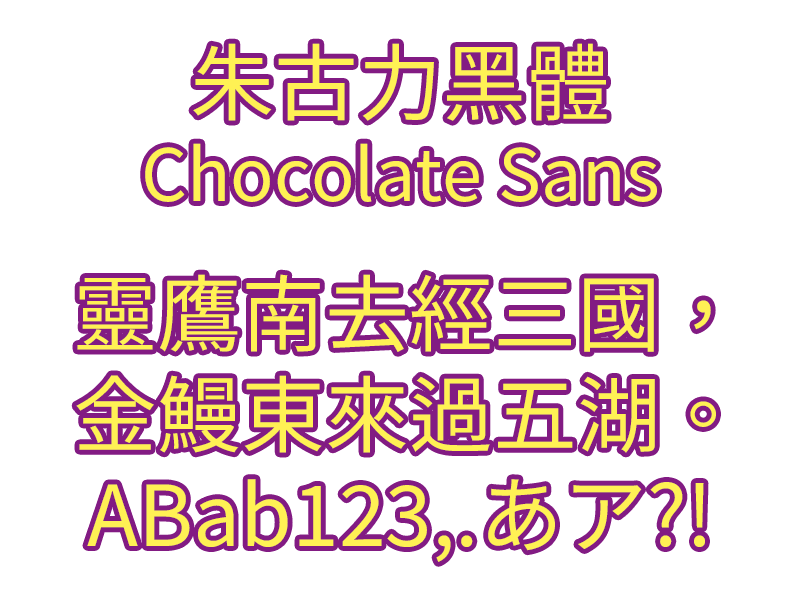

# 🌕朱古力黑體 Chocolate Classical Sans

## 🌕提要

「朱古力黑體（Chocolate Classical Sans）」爲適用於繁體中文環境的開源字型，它以[Adobe與Google合作開發的「思源黑體」字型](https://github.com/adobe-fonts/source-han-sans/)爲基礎，局部參考傳承字形，包括[傳承字形標準化文件](https://github.com/ichitenfont/inheritedglyphs)的推薦形體，與其他常見的傳承字形，把字形修改爲中文傳統的形體，並補製一些欠缺的漢字。

## 🌕下載

目前最新版本爲1.000版，發佈於2024年4月23日。

🌕 [朱古力黑體 Chocolate Classical Sans 下載](fonts/ChocolateClassicalSans.otf) 🌕

下載方法：點進連結後，按「View raw」欄右上方的「Download raw file」按鈕（如下圖紅圈所示）。

另有特殊版本「簡繁轉換版」，收錄字數較少，方便把簡體文件顯示成繁體中文。但它包含的字符都比較少，請確定有必要才使用它。此版本以[GuiWonder開發的「中文字型簡繁處理工具」](https://github.com/GuiWonder/TCFontCreator)製作。

🌕 [朱古力黑體（簡轉轉換） Chocolate Sans Sim-to-Trad 下載](fonts/ChocolateSansSimtoTrad.otf) 🌕

## 🌕製作說明

本字型由[田海東](https://github.com/jisbig5)主力製作，宇文滿月參與修改，以應付屏顯和排印之需。

本字型借用了[Steve Yuu](https://github.com/Steve-Yuu)、[GuiWonder](https://github.com/GuiWonder)及[秋明](https://github.com/ChiuMing-Neko)的開源貢獻而製作。

礙於人力、時間等限制，本字型尚有不少地方有待高賢不吝賜正，敬祈見諒。

## 🌕聯絡滿月
關於本字型的問題，可以在本專案的[issue](https://github.com/MoonlitOwen/ChocolateSans/issues)上提出。

滿月自己是VTuber，平日活躍於YouTube和社交媒體，歡迎瀏覽滿月的連結集：[http://lit.link/moonlitowen](http://lit.link/moonlitowen)，訂閱[滿月的YouTube頻道](https://www.youtube.com/@moonlitowen)和追蹤滿月的社交媒體💛💜

## 🌕鳴謝
* [傳承字形標準化文件](https://github.com/ichitenfont/inheritedglyphs)
* [一點字坊（I.字坊 I.Font Project）](https://github.com/ichitenfont)
* [霞鶩晰黑](https://github.com/lxgw/LxgwXiHei)
* [源樣黑體（GenYoGothic）](https://github.com/ButTaiwan/genyog-font)
* [思源黑體（Source Han Sans/Noto Sans CJK）的日文和韓文版](https://github.com/adobe-fonts/source-han-sans/)
* [中文字型簡繁處理工具（TC Font Creator）](https://github.com/GuiWonder/TCFontCreator)
* [秋空󠄁黑體（ChiuKong Gothic）](https://github.com/ChiuMing-Neko/ChiuKongGothic)
* [Yuu黑體（Yuu-Gothic）舊字形版](https://github.com/Steve-Yuu/Yuu-Gothic)
* [尚古黑體（Shanggu Sans）](https://github.com/GuiWonder/Shanggu)
